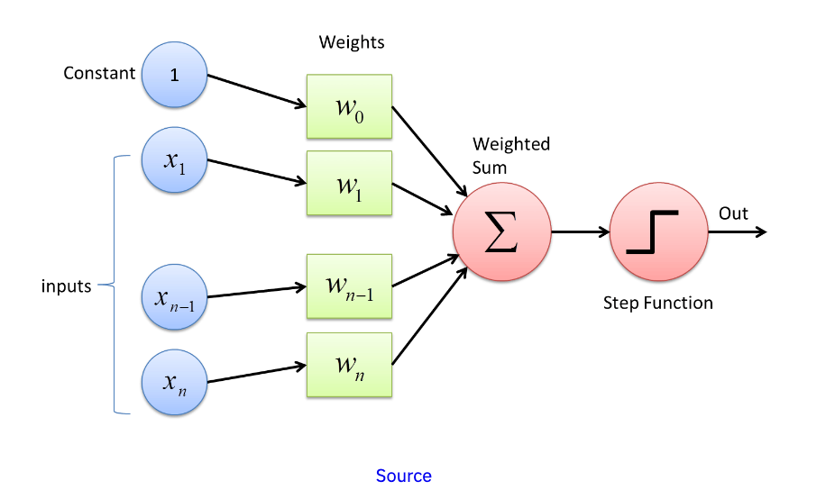
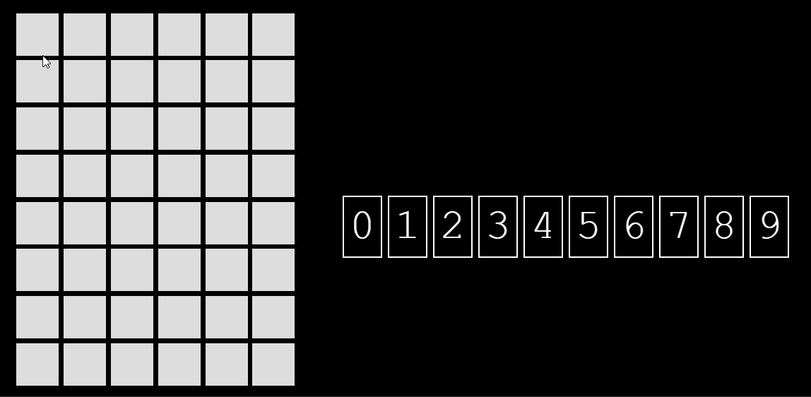
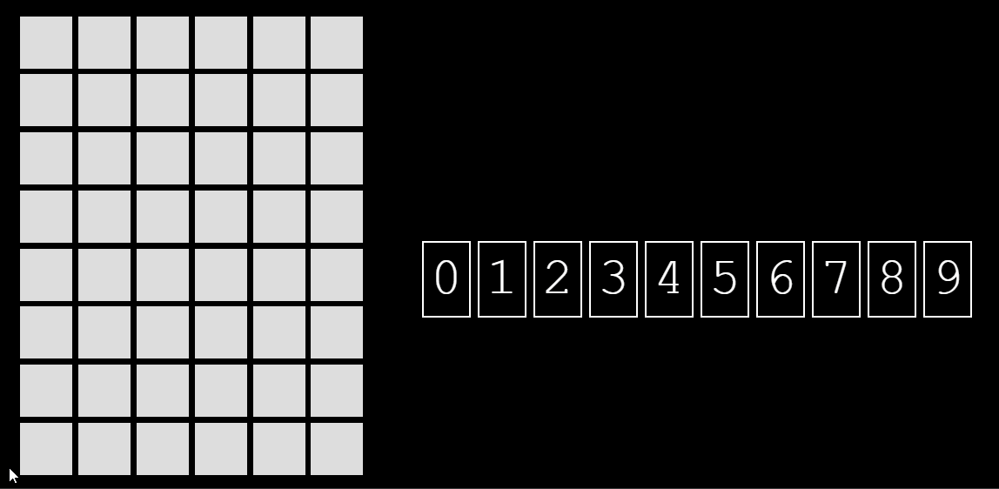

# Digit recognition with Perceptrons
 

#### https://en.wikipedia.org/wiki/Perceptron
### It is a simple web application written in Javascript that recognizes a number based on the data entered by the user.

### Files:
`perceptron1.js` - main perceptron handling code
`pixel.js` - handling the interface and calling functions exported from perceptron1.js
`data.js` -dataset for perceptron learning

